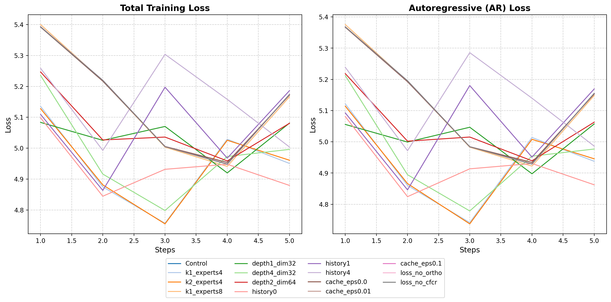
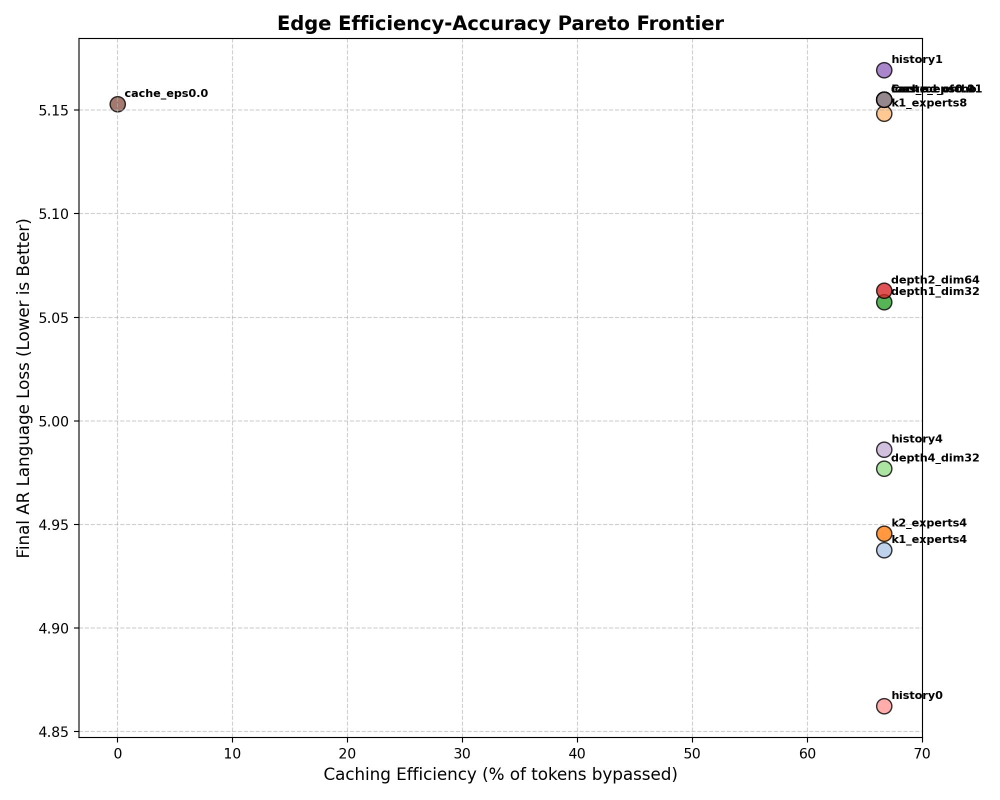
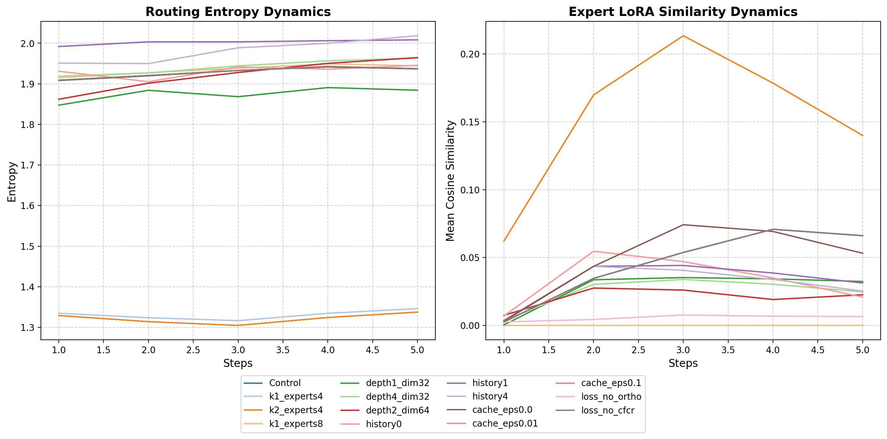

# Hyperparameter Sweep & Performance Evaluation Report

This report summarizes the experimental results of the hyperparameter sweep training runs on the Micro-MoE architecture.

## 1. Summary of Performance Metrics

| Configuration | Total Loss | AR Loss | Aux Loss | CFCR Loss | Ortho Loss | Caching Efficiency (%) | Routing Entropy | Expert Cosine Similarity |
| --- | --- | --- | --- | --- | --- | --- | --- | --- |
| Control | 5.1738 | 5.1551 | 1.7717 | 0.0033 | 0.0708 | 66.67% | 1.9374 | 0.0661 |
| k1_experts4 | 4.9506 | 4.9376 | 1.2705 | 0.0026 | 0.0000 | 66.67% | 1.3462 | 0.0000 |
| k2_experts4 | 4.9610 | 4.9456 | 1.3325 | 0.0025 | 0.1786 | 66.67% | 1.3377 | 0.1399 |
| k1_experts8 | 5.1661 | 5.1484 | 1.7395 | 0.0033 | 0.0000 | 66.67% | 1.9443 | 0.0000 |
| depth1_dim32 | 5.0811 | 5.0573 | 2.3212 | 0.0022 | 0.0343 | 66.67% | 1.8843 | 0.0324 |
| depth4_dim32 | 4.9961 | 4.9770 | 1.8411 | 0.0035 | 0.0303 | 66.67% | 1.9634 | 0.0247 |
| depth2_dim64 | 5.0806 | 5.0629 | 1.7156 | 0.0038 | 0.0191 | 66.67% | 1.9645 | 0.0226 |
| history0 | 4.8794 | 4.8624 | 1.6674 | 0.0000 | 0.0350 | 66.67% | 1.9457 | 0.0208 |
| history1 | 5.1861 | 5.1693 | 1.6037 | 0.0034 | 0.0386 | 66.67% | 2.0083 | 0.0312 |
| history4 | 5.0037 | 4.9862 | 1.7088 | 0.0011 | 0.0339 | 66.67% | 2.0184 | 0.0253 |
| cache_eps0.0 | 5.1717 | 5.1530 | 1.7692 | 0.0033 | 0.0692 | 0.00% | 1.9366 | 0.0532 |
| cache_eps0.01 | 5.1738 | 5.1551 | 1.7717 | 0.0033 | 0.0708 | 66.67% | 1.9374 | 0.0661 |
| cache_eps0.1 | 5.1738 | 5.1551 | 1.7717 | 0.0033 | 0.0708 | 66.67% | 1.9374 | 0.0661 |
| loss_no_ortho | 5.1731 | 5.1551 | 1.7716 | 0.0033 | 0.0068 | 66.67% | 1.9374 | 0.0065 |
| loss_no_cfcr | 5.1735 | 5.1551 | 1.7735 | 0.0034 | 0.0709 | 66.67% | 1.9370 | 0.0661 |

## 2. Experimental Plots

- **Learning Curves**: Compare loss decay curves over training steps between different hyperparameter choices.  
  
- **Efficiency vs. Accuracy Pareto Frontier**: Scatter plot displaying the caching efficiency versus final AR loss tradeoff. The ideal configuration sits towards the bottom-right corner.  
  
- **Routing Stability & Expert Divergence**: Line chart visualizing how average routing entropy and LoRA parameter similarities evolve over steps.  
  
