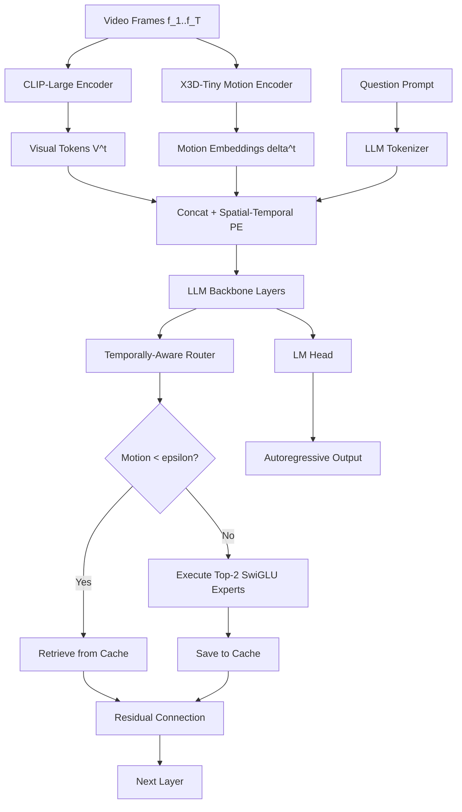

# Implementation Plan: T-MoE-LLaVA 2.0 (Micro-MoE)

This document outlines the detailed architecture, modular design, training stages, evaluation suite, and ablation plan for **T-MoE-LLaVA 2.0 (Micro-MoE)**. This system is designed specifically for resource-constrained environments (single-node A100/L4 GPU).

---

## 1. Architectural Design & Framing

### The Academic Framing
We frame the paper around the concept of **Kinetic Efficiency for Edge Video VLMs**. 
*   **The Problem:** Existing Video VLMs process every frame/token with uniform compute, wasting massive energy on static video backgrounds.
*   **The Solution:** We propose a **Micro-MoE** (based on a 1.5B base LLM) that uses a **Temporally-Conditioned Router** to dynamically scale compute down to $O(1)$ for static video regions while routing dynamic motion patches to specialized experts.

---

## 2. Core Modules to Implement

We will construct a modular PyTorch package inside the project directory:

```
Temporal_MoE_Based_Vision_Transformer/
├── models/
│   ├── __init__.py
│   ├── motion_encoder.py
│   ├── router.py
│   ├── cache.py
│   ├── moe_layer.py
│   └── tmoe_model.py
├── train/
│   ├── __init__.py
│   ├── loss.py
│   └── trainer.py
├── tests/
│   └── test_modules.py
└── run_pipeline.py
```

### Module Descriptions & Mathematical Functions

### 1. `motion_encoder.py` (Kinematic Motion Encoder)
*   **Function:** Extracts clean, camera-invariant spatial motion features from raw frame inputs.
*   **Operations:**
    1.  Given frames $f_t, f_{t-1} \in \mathbb{R}^{H \times W \times 3}$.
    2.  Extract optical flow or direct spatial representation using a lightweight 3D CNN (X3D-Tiny):
        $$\delta_i^t = \text{X3D-Tiny}(f_{t-w:t+w})_i \in \mathbb{R}^{M} \quad (M = 256)$$
    3.  Project features to hidden dimension $d = 4096$:
        $$\delta_{proj, i}^t = \delta_i^t W_{mot} + b_{mot} \in \mathbb{R}^{d}$$

### 2. `router.py` (Temporally-Aware Router)
*   **Function:** Decides which experts to activate based on token content and temporal history.
*   **Operations:**
    1.  Compute causal temporal context $c_t$ over a window $w$ (historical sequence window):
        $$c_t = \text{Conv1D}(X_{t-w:t}^{(l-0.5)}) \in \mathbb{R}^d$$
    2.  Concat token representation $x_t$ and its temporal context $c_t$, then project to gate logits:
        $$g_t = W_{g,1} x_t + W_{g,2} c_t \in \mathbb{R}^N \quad (N = 8 \text{ experts})$$
    3.  Compute routing coefficients:
        $$P_t = \text{softmax}(g_t / \tau) \in \mathbb{R}^N$$
    4.  Extract motion confidence scalar:
        $$m_i^t = \sigma(W_m \delta_{proj, i}^t + b_m) \in [0, 1]$$

### 3. `cache.py` (Event-Based Token Cache Controller)
*   **Function:** Implements the $O(1)$ compute bypass for static visual tokens across consecutive frames.
*   **Operations:**
    1.  For each patch $i$ at frame $t$, if $m_i^t < \epsilon$ (where $\epsilon \approx 0.05$):
        *   Bypass MoE layer.
        *   $\text{MoE}(x_i^t) = \text{Cache}[i]^{t-1}$.
    2.  Else (if $m_i^t \ge \epsilon$):
        *   Execute standard MoE layer forward pass.
        *   $\text{Cache}[i]^t \leftarrow \text{MoE}(x_i^t)$.

### 4. `moe_layer.py` (T-CHE Homogeneous Layer with QLoRA)
*   **Function:** Hosts the 8 FFN experts and manages their parameter-efficient fine-tuning (LoRA).
*   **Operations:**
    1.  Base FFN layers are frozen and quantized (NF4).
    2.  Add LoRA adapters ($r=64$, $\alpha=128$) to the gate, up, and down projection matrices:
        $$W = W_{base} + \frac{\alpha}{r} (B \cdot A)$$
    3.  Run Grouped GEMM over the Top-2 active experts.

---

## 3. The End-to-End Pipeline



---

## 4. Training & Loss Formulation

### Custom Multi-Task Loss:
$$L_{total} = L_{ar} + \alpha L_{aux} + \beta L_{cfcr} + \gamma L_{ortho}$$

*   **Autoregressive Loss ($L_{ar}$):** Standard cross-entropy over text tokens.
*   **Load Balancing ($L_{aux}$):** Softmax-based load balancing penalty to avoid router routing to a single expert.
*   **CFCR Loss ($L_{cfcr}$):** Cross-frame routing consistency using Jensen-Shannon Divergence and attention-based alignment $A_{i,j}$ to track spatial patch shifting:
    $$L_{cfcr} = \frac{1}{T \cdot P} \sum_{t=1}^{T-1} \sum_{i,j} A_{i,j} (1 - m_i^t) \cdot \text{JSD}(P_i^t \parallel P_j^{t+1})$$
*   **Ortho Loss ($L_{ortho}$):** Cosine similarity penalty between expert LoRA weights to prevent expert collapse:
    $$L_{ortho} = \sum_{i \neq j} \frac{| \text{Tr}(B_i^T B_j) |}{\|B_i\|_F \|B_j\|_F}$$

---

## 5. Evaluation & Verification Suite

### Automated Unit Tests (`tests/test_modules.py`)
1.  **Sequence Concatenation Test:** Verifies shape consistency for concatenated visual, motion, and text token vectors.
2.  **Caching Consistency Test:** Passes static identical frames twice; verifies that the FFN outputs for $t=2$ are exact copies of the cache (i.e. zero FLOP execution for $t=2$).
3.  **Router Gradients Test:** Verifies that routing weights generate gradients through the Modality-Aware routing function without breaking backpropagation.
4.  **Expert Divergence Test:** Computes pairwise cosine similarity between expert LoRA $B$ matrices after training. Expects mean similarity < 0.2 (i.e., experts have diverged). Fails if $L_{ortho}$ is not working.
5.  **CFCR Loss Monotonicity Test:** Feeds a pair of identical frames and verifies $L_{cfcr} \approx 0$; feeds a high-motion pair and verifies $L_{cfcr} > 0$.
6.  **LM Head Output Test:** Runs a single-frame forward pass and checks logits shape is $[1, |V|]$ without NaN/Inf values.

---

## 6. Evaluation Metrics (Full Stack)

> ⚠️ BLEU is insufficient as a primary metric for video VQA. It measures surface n-gram overlap and severely penalizes semantically correct paraphrases. Use the full layered metric stack below.

### Axis 1: Task-Specific Benchmark Accuracy (Main Results Table)

These are the numbers that anchor your primary comparison table.

| Benchmark | Metric | Task Type | Why It Matters |
|---|---|---|---|
| **MVBench** | Top-1 Accuracy (%) | Multi-task temporal reasoning | 20 sub-tasks; industry-standard VQA comparison |
| **Video-MME** | Top-1 Accuracy (%) | Long-form video QA | Tests routing consistency over long sequences |
| **NExT-QA** | WUPS + MC Accuracy | Causal & temporal reasoning | Specifically probes *why* events happen |
| **ActivityNet-QA** | Accuracy + GPT-4 Score (0-5) | Open-ended activity description | Tests fluency and factual correctness jointly |
| **EgoSchema** | Top-1 Accuracy (%) | First-person egocentric video | High-motion density stress test for MCR router |
| **TemporalBench** | Accuracy (%) | Fine-grained temporal ordering | Directly validates CFCR loss contribution |

---

### Axis 2: Open-Ended Generation Quality Metrics

For open-ended answer generation tasks (ActivityNet-QA, Video-ChatGPT style eval):

**BERTScore (Primary — Semantic Similarity):**
$$P_{BERT} = \frac{1}{|\hat{y}|} \sum_{\hat{y}_j \in \hat{y}} \max_{y_i \in y} \cos(\mathbf{e}_{\hat{y}_j}, \mathbf{e}_{y_i})$$
$$F_{BERT} = 2 \cdot \frac{P_{BERT} \cdot R_{BERT}}{P_{BERT} + R_{BERT}}$$

**CIDEr (Primary — Consensus Scoring):**
$$\text{CIDEr}_n(c, S) = \frac{1}{M} \sum_{i=1}^{M} \frac{g^n(c) \cdot g^n(s_i)}{\|g^n(c)\| \|g^n(s_i)\|}$$
Where $g^n$ is the TF-IDF weighted n-gram representation. Higher CIDEr = the model's output matches the consensus of multiple references.

**METEOR (Secondary — Synonym-Aware):**
Harmonic mean of unigram precision/recall with synonym and morphological matching via WordNet. Handles paraphrasing better than BLEU.

**ROUGE-L (Secondary — Sequence Coverage):**
$$\text{ROUGE-L} = F_1 \text{ based on Longest Common Subsequence}$$

**BLEU-4 (Reported for Completeness Only):**
$$\text{BLEU-N} = BP \cdot \exp\left( \sum_{n=1}^{N} w_n \log p_n \right)$$
Where $p_n$ is the modified n-gram precision and $BP$ is the brevity penalty. Report BLEU-1 and BLEU-4 only in the appendix since reviewers expect it, but do not cite it as your primary result.

**GPT-4 Eval (For ActivityNet-QA pipeline):**
Prompt GPT-4 to rate predicted vs. reference answer on a 1–5 scale for correctness and detail. This is the evaluation protocol from the original Video-ChatGPT paper and is expected by reviewers on activity captioning tasks.

---

### Axis 3: Efficiency Metrics (Core Novelty — No Other Paper Reports These)

This is your **primary differentiator** vs. quantized large models. Reported in a dedicated Efficiency Analysis table.

| Metric | Definition | What It Proves |
|---|---|---|
| **FLOPs/Frame** | Total multiply-adds for one frame forward pass | Dynamic compute scaling with motion |
| **FLOPs@static** | FLOPs when $m_i^t < \epsilon$ for all patches | Cache bypass → $O(1)$ static cost |
| **FLOPs@dynamic** | FLOPs when $m_i^t \geq \epsilon$ for all patches | Compute ceiling — worst case |
| **FLOPs Reduction Ratio** | $1 - \frac{\text{FLOPs}_{ours}}{\text{FLOPs}_{dense\text{-}1.5B}}$ | Core efficiency claim |
| **Inference Latency** | ms/frame and frames/sec on L4 GPU | Hardware-grounded efficiency |
| **Peak VRAM (GB)** | During training and inference | Validates single-node feasibility |
| **Active Parameters** | Params activated per token (not total model size) | Pareto comparison against dense baselines |
| **Energy per Video (mJ)** | FLOPs × hardware TDP / throughput (estimated) | Performance-per-Watt claim |

**Key Plot: Pareto Frontier Scatter**
Y-axis = MVBench Accuracy (%), X-axis = FLOPs/Frame. Plot your model alongside baselines. Your model should sit in the **top-left quadrant** (high accuracy, low compute). This figure anchors the paper.

---

### Axis 4: Routing & Specialization Diagnostic Metrics (Ablation Tables)

| Metric | Definition | What It Shows |
|---|---|---|
| **Routing Entropy** $H(P)$ | $H(P) = -\sum_i P_i \log P_i$ | Low entropy → routing collapsed to 1 expert |
| **Expert Utilization Balance** | Fraction of tokens routed to each expert | Verifies $L_{aux}$ is preventing expert starvation |
| **Motion-Stratified Routing** | Routing distribution bucketed by $m_i^t$ values | Killer figure: low-$\delta$ → Experts 1-2, high-$\delta$ → Experts 3-4 |
| **LoRA Subspace Overlap** | Mean pairwise cosine sim of $B_i$ matrices | Should be < 0.2 when $L_{ortho}$ is active |
| **Temporal Shuffling Delta** | Accuracy drop when frames are shuffled randomly | Proves the model uses temporal order, not just spatial features |

---

## 7. Ablation Studies

| Ablation | Variable Changed | Primary Metric | Secondary Metric | Expected Finding |
|---|---|---|---|---|
| **Remove $L_{ortho}$** | $\gamma = 0$ | MVBench Accuracy | Routing Entropy / LoRA Subspace Overlap | Expert collapse → routing entropy collapses, accuracy drops |
| **Remove $L_{cfcr}$** | $\beta = 0$ | TemporalBench Accuracy | BERTScore on ActivityNet | Temporal hallucination increases; consistency breaks |
| **Remove temporal context** | $c_t = x_t$ (no history) | NExT-QA WUPS | FLOPs/Frame | Router loses causal awareness; dynamic tokens misrouted |
| **Vary cache threshold $\epsilon$** | $\epsilon \in \{0.0, 0.01, 0.05, 0.1\}$ | MVBench Accuracy | FLOPs/Frame | Pareto curve: $\epsilon=0$ (max compute) vs $\epsilon=0.1$ (max efficiency) |
| **Standard routing vs. MCR** | No motion conditioning | NExT-QA / EgoSchema | Routing Entropy | Motion-conditioned routing improves causal video reasoning |
| **LoRA rank sensitivity** | $r \in \{8, 32, 64, 128\}$ | MVBench Accuracy | LoRA Subspace Overlap | $r < 64$ causes collapse; $r = 64$ is the minimum safe rank |

**Expert Specialization Visualization (Killer Figure):**
Plot routing distribution heatmap with rows = motion magnitude bucket ($\delta \in [0, 0.2), [0.2, 0.5), [0.5, 1.0]$) and columns = expert index (1-8). If the architecture works correctly:
- Low-$\delta$ tokens (static background) → Expert 1, 2
- High-$\delta$ tokens (moving objects) → Expert 3, 4, 5
- Text tokens → Expert 7, 8

This is empirical proof that your $L_{ortho}$ + temporal routing successfully induces specialization without explicit forcing.
